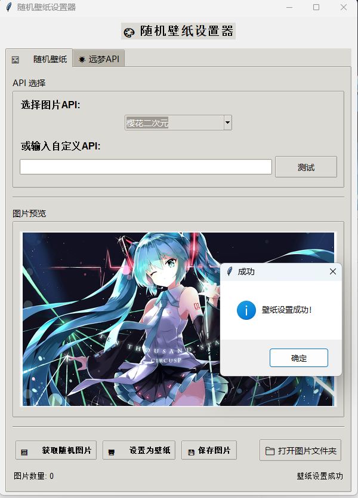

# 🎨 随机壁纸设置器

一个功能强大的随机壁纸设置器，支持多种图片API，具有现代化的图形用户界面。

## 📸 界面预览


## ✨ 功能特点

- 🖼️ **多种图片API支持**：内置6种不同类型的图片API
- 🎯 **实时图片预览**：获取图片后立即预览
- 🖥️ **一键设置壁纸**：支持Windows、macOS、Linux系统
- 💾 **图片保存功能**：可保存喜欢的图片到本地
- 🎨 **图片清晰化处理**：自动优化图片质量
- 📁 **文件夹管理**：快速打开图片文件夹
- 🔧 **自定义API支持**：支持输入自定义图片API
- 🌟 **远梦API集成**：高质量PC壁纸，支持多种分类

## 🚀 快速开始

### 1. 安装依赖

```bash
# 方法一：使用requirements.txt
pip install -r requirements.txt

# 方法二：手动安装
pip install pillow requests
```

### 2. 运行程序

#### 方法一：直接运行GUI
```bash
python gui.py
```

#### 方法二：使用启动脚本
```bash
python run_gui.py
```

#### 方法三：使用exe可执行文件
- 在该项目releases中下载RandomWallpaper.exe
- 直接运行exe文件，无需安装Python环境在该项目

## 📋 使用说明

### 主界面布局

程序采用标签页设计，包含两个主要功能模块：

#### 标签页1：🖼️ 随机壁纸
```
┌─────────────────────────────────────────┐
│           🎨 随机壁纸设置器              │
├─────────────────────────────────────────┤
│ API 选择                                │
│ ├─ 选择图片API: [下拉菜单]              │
│ └─ 自定义API: [输入框] [测试]           │
├─────────────────────────────────────────┤
│ 图片预览                                │
│ ┌─────────────────────────────────────┐ │
│ │                                     │ │
│ │        图片预览区域                  │ │
│ │                                     │ │
│ └─────────────────────────────────────┘ │
├─────────────────────────────────────────┤
│ [🖼️ 获取随机图片] [🖥️ 设置为壁纸]      │
│ [💾 保存图片] [📁 打开图片文件夹]       │
├─────────────────────────────────────────┤
│ 图片数量: 0                    就绪     │
└─────────────────────────────────────────┘
```

#### 标签页2：🌟 远梦API
```
┌─────────────────────────────────────────┐
│           🌟 远梦API - 随机PC壁纸        │
├─────────────────────────────────────────┤
│ 壁纸分类选择                            │
│ ├─ 选择壁纸分类: [下拉菜单]             │
├─────────────────────────────────────────┤
│ 壁纸预览                                │
│ ┌─────────────────────────────────────┐ │
│ │                                     │ │
│ │        壁纸预览区域                  │ │
│ │                                     │ │
│ └─────────────────────────────────────┘ │
├─────────────────────────────────────────┤
│ [🖼️ 获取随机壁纸] [🖥️ 设置为壁纸]      │
│ [💾 保存壁纸] [📁 打开图片文件夹]       │
├─────────────────────────────────────────┤
│ 图片数量: 0                    就绪     │
└─────────────────────────────────────────┘
```

### 操作步骤

#### 标签页1：🖼️ 随机壁纸
1. **选择API**：
   - 从下拉菜单选择预设的图片API
   - 或输入自定义API地址并点击"测试"

2. **获取图片**：
   - 点击"🖼️ 获取随机图片"按钮
   - 等待图片下载完成，预览区域会显示图片

3. **设置壁纸**：
   - 点击"🖥️ 设置为壁纸"按钮
   - 系统会自动将当前预览的图片设置为桌面壁纸

4. **保存图片**：
   - 点击"💾 保存图片"按钮
   - 选择保存位置和文件名

5. **管理图片**：
   - 点击"📁 打开图片文件夹"查看所有下载的图片

#### 标签页2：🌟 远梦API
1. **选择分类**：
   - 从下拉菜单选择壁纸分类（如风景、动漫、游戏等）
   - 选择"随机壁纸"可获取任意分类的壁纸

2. **获取壁纸**：
   - 点击"🖼️ 获取随机壁纸"按钮
   - 等待壁纸下载完成，预览区域会显示壁纸

3. **设置壁纸**：
   - 点击"🖥️ 设置为壁纸"按钮
   - 系统会自动将当前预览的壁纸设置为桌面壁纸

4. **保存壁纸**：
   - 点击"💾 保存壁纸"按钮
   - 选择保存位置或自动保存到images文件夹

5. **管理壁纸**：
   - 点击"📁 打开图片文件夹"查看所有下载的壁纸

## 🎯 支持的API类型

### 标签页1：🖼️ 随机壁纸
| API类型 | 描述 | 地址 |
|---------|------|------|
| 随机各类壁纸 | 多种类型的随机壁纸 | https://api.btstu.cn/sjbz/api.php |
| 随机动漫壁纸 | 动漫风格的壁纸 | https://api.paugram.com/wallpaper/ |
| 随机二次元 | 二次元风格图片 | https://cdn.seovx.com/d/?mom=302 |
| 随机美图 | 精选美图 | https://cdn.seovx.com/?mom=302 |
| 随机古风 | 古风风格图片 | https://cdn.seovx.com/ha/?mom=302 |
| 樱花二次元 | 樱花二次元图片 | https://www.dmoe.cc/random.php |

### 标签页2：🌟 远梦API
远梦API提供高质量的PC壁纸，支持多种分类：
- **风景壁纸**：自然风光、城市景观
- **动漫壁纸**：二次元、动漫角色
- **游戏壁纸**：游戏截图、游戏角色
- **动物壁纸**：各种动物图片
- **抽象壁纸**：抽象艺术风格
- **其他分类**：更多精彩分类

*注：远梦API需要 `yuanmeng_api.py` 模块支持，如果模块不存在，相关功能将不可用。*

## 🔧 自定义API

### 标签页1：🖼️ 随机壁纸
你可以输入任何返回图片的API地址，程序会自动检测图片格式并下载。

#### API要求：
- 返回HTTP状态码200
- 返回有效的图片文件
- 支持GET请求

#### 测试API：
点击"测试"按钮可以验证API是否可用。

### 标签页2：🌟 远梦API
远梦API是内置的高质量壁纸API，无需自定义配置。

## 📁 文件结构

```
ImageRandom/
├── gui.py               # GUI版本主程序
├── myAPI.py             # 核心API功能模块
├── yuanmeng_api.py      # 远梦API模块（可选）
├── run_gui.py           # GUI启动脚本
├── requirements.txt     # 依赖包列表
├── images/              # 图片保存目录
├── imgRandom.log        # 日志文件
├── GUI.png              # 界面截图
└── README.md            # 项目说明文档
```

## 🛠️ 系统要求

- **操作系统**：Windows 10/11, macOS 10.14+, Linux
- **Python版本**：Python 3.6+
- **依赖包**：tkinter, PIL (Pillow), requests
- **可选依赖**：yuanmeng_api.py（远梦API支持）

## 🔍 故障排除

### 常见问题

1. **GUI无法启动**
   - 检查Python版本是否为3.6+
   - 确认已安装所有依赖包

2. **图片下载失败**
   - 检查网络连接
   - 尝试更换API
   - 查看日志文件了解详细错误

3. **壁纸设置失败**
   - 确认图片文件存在且完整
   - 检查系统权限
   - Windows用户可能需要以管理员身份运行

4. **预览显示异常**
   - 确认图片格式支持
   - 检查PIL库是否正确安装

5. **远梦API功能不可用**
   - 确认 `yuanmeng_api.py` 文件存在
   - 检查网络连接是否正常
   - 查看控制台输出的错误信息

### 日志查看

程序运行时会生成 `myAPI.log`、`yuanmenAPI.log` 文件，包含详细的运行日志，可用于故障排查。

## 🎨 界面截图

程序具有现代化的界面设计，包含：
- 清晰的布局结构
- 直观的操作按钮
- 实时状态显示
- 图片预览功能

## 📝 更新日志

### v1.0.0
- 初始GUI版本发布
- 支持多种图片API
- 实时图片预览
- 一键设置壁纸
- 图片保存功能

- 新增标签页设计，支持多种API
- 集成远梦API，提供高质量PC壁纸
- 支持壁纸分类选择
- 优化图片预览和保存功能
- 改进错误处理和用户体验

## 🤝 贡献

感谢以上免费图片壁纸的api提供者，祝大家财源滚滚！

欢迎提交问题报告和功能建议！

## 📄 许可证

本项目采用Apache License 2.0许可证。
